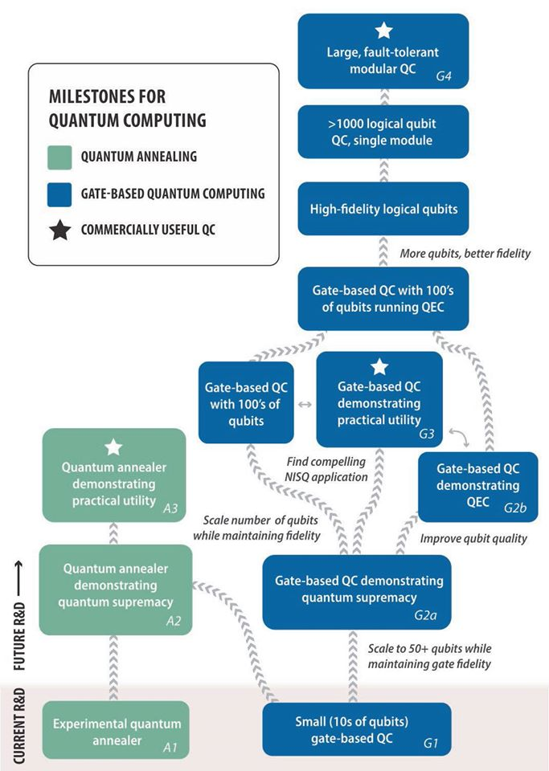

# q-info

Image Courtesy: [Quantum Computing, Progress and Prospects](https://www.nap.edu/catalog/25196/quantum-computing-progress-and-prospects)

1. A zoo of "Quantum Algorithms": http://quantumalgorithmzoo.org/
2. https://www.clerro.com/guide/580/quantum-computing-explained
3. Book online : https://community.qiskit.org/textbook/
4. Qiskit Documentation: https://qiskit.org/documentation/
5. ANPA winter school: https://github.com/anpaschool/quantum-computing/tree/master/

### Algorithms:
1. Deutsch-Jozsa Algorithm : https://medium.com/@jonathan_hui/qc-quantum-algorithm-with-an-example-cf22c0b1ec31
2. Grover Algorithm: https://medium.com/@jonathan_hui/qc-grovers-algorithm-cd81e61cf248
3. Simons Algorithm: https://medium.com/@jonathan_hui/qc-simons-algorithm-be570a40f6de
4. RSA: https://medium.com/@jonathan_hui/qc-cracking-rsa-with-shors-algorithm-bc22cb7b7767

### Grover's Algorithm
1. https://blog.usejournal.com/breaking-cryptosystems-with-quantum-computers-c83b0fd991d8
2. https://www.semanticscholar.org/paper/Application-of-Grover's-Algorithm-on-the-ibmqx4-to-Kirke/
3. https://quantumcomputingtech.blogspot.com/2018/03/grovers-algorithm-quantum-circuit.html

### Q-Latex
1. http://ctan.math.washington.edu/tex-archive/graphics/pgf/contrib/quantikz/quantikz.pdf
2. https://github.com/qpic/qpic

### IBM 2019 Challange
1. [IBM Quantum Award Winners Announced](https://www.ibm.com/blogs/research/2020/03/2019-ibmq-awards/)
2. 

